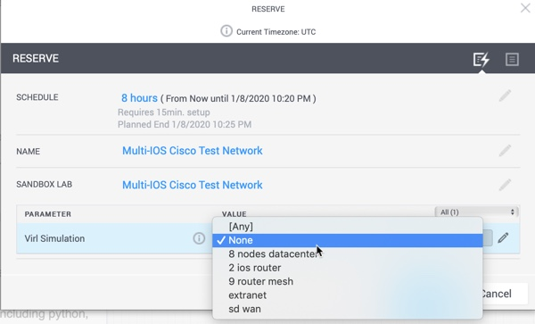

# BRKDEV-1368

# Environment Setup

Follow these instructions to standup the demo and code environment.  

1. Pre-reqs
    * Python 2.7 and Python 3.6
      * pip and virtualenv

1. If you haven't already, clone down this repository to your local workstation. 

    ```bash
    git clone https://github.com/CiscoDevNet/BRKDEV-1368.git
    ```

1. Change into the code repository directory. 

    ```bash
    cd BRKDEV-1368
    ```


1. Setup Python Virtual Environment

    ```bash
    python3 -m venv venv
    source venv/bin/activate
    pip install -r requirements.txt
    ```

1. Reserve an instance of [DevNet Sandbox - Multi-IOS Test Network](https://devnetsandbox.cisco.com/RM/Diagram/Index/6b023525-4e7f-4755-81ae-05ac500d464a?diagramType=Topology). Pick **None** as the `Virl Simulation` before reserving.  This will start the lab with NO topology loaded in VIRL, we'll be starting our own. 

    

    > It will take about 10 minutes for the lab to fully spin up.  

1. Once your lab is ready, use the VPN credentials you recieve via email, or find in the **OUTPUT** box in the Sandbox portal to connect to your lab. 

1. We will use the Python package `virlutils` to start the lab.  If you don't have it installed already, go ahead and do so now. 

    > Note: This guide assumes a basic knowledge of Python and doesn't explicitly state to use a virtual environment, or a version of Python to use.  Any recent version of Python and common working environment should work. 

    ```bash
    pip install virlutils
    ```

1. Verify that your lab and virlutils is working.

    ```bash
    # Check what version of VIRL is loaded (verify you can talk to server)
    virl version

    # Check if any simulations are running
    virl ls --all
    ```

    <details><summary>Output</summary>

    ```
    $virl version
    virlutils Version: 0.8.8
    VIRL Core Version: 0.10.37.32
    
    $ virl ls --all
    Running Simulations
    ╒══════════════╤══════════╤════════════════════════════╤═══════════╕
    │ Simulation   │ Status   │ Launched                   │ Expires   │
    ╞══════════════╪══════════╪════════════════════════════╪═══════════╡
    │ ~jumphost    │ ACTIVE   │ 2019-12-15T16:27:42.567768 │           │
    ╘══════════════╧══════════╧════════════════════════════╧═══════════╛
    ```

    </details>


    * If any simulation other than `~jumphost` is running, stop it with the following command. 

        ```bash
        virl down --sim-name {SIMULATION_NAME}
        ```

1. Jump into the demo directory where the topology file is located. 

    ```bash
    cd demo
    ```

1. Start a simulation for this lab. 

    ```bash
    virl up
    ```

    <details><summary>Output</summary>

    ```
    Creating default environment from topology.virl
    ```

    </details>

1. It will take several minutes for the simulation to fully start, you can monitor it with the following command - waiting for all devices to show `REACHABLE`

    ```bash
    virl nodes
    ```

    <details><summary>Devices Details</summary>

    ```bash
    ╒═══════════╤══════════╤═════════╤═════════════╤════════════╤══════════════════════╤════════════════════╕
    │ Node      │ Type     │ State   │ Reachable   │ Protocol   │ Management Address   │ External Address   │
    ╞═══════════╪══════════╪═════════╪═════════════╪════════════╪══════════════════════╪════════════════════╡
    │ iosxe1    │ CSR1000v │ ACTIVE  │ REACHABLE   │ telnet     │ 172.16.30.181        │ N/A                │
    ├───────────┼──────────┼─────────┼─────────────┼────────────┼──────────────────────┼────────────────────┤
    │ iosxe2    │ CSR1000v │ ACTIVE  │ REACHABLE   │ telnet     │ 172.16.30.182        │ N/A                │
    ├───────────┼──────────┼─────────┼─────────────┼────────────┼──────────────────────┼────────────────────┤
    │ iosxe3    │ CSR1000v │ ACTIVE  │ REACHABLE   │ telnet     │ 172.16.30.183        │ N/A                │
    ├───────────┼──────────┼─────────┼─────────────┼────────────┼──────────────────────┼────────────────────┤
    │ iosxe4    │ CSR1000v │ ACTIVE  │ REACHABLE   │ telnet     │ 172.16.30.184        │ N/A                │
    ├───────────┼──────────┼─────────┼─────────────┼────────────┼──────────────────────┼────────────────────┤
    │ ~mgmt-lxc │ mgmt-lxc │ ACTIVE  │ REACHABLE   │ ssh        │ 172.16.30.118        │ 172.16.30.119      │
    ╘═══════════╧══════════╧═════════╧═════════════╧════════════╧══════════════════════╧════════════════════╛

    ```

    </details>


